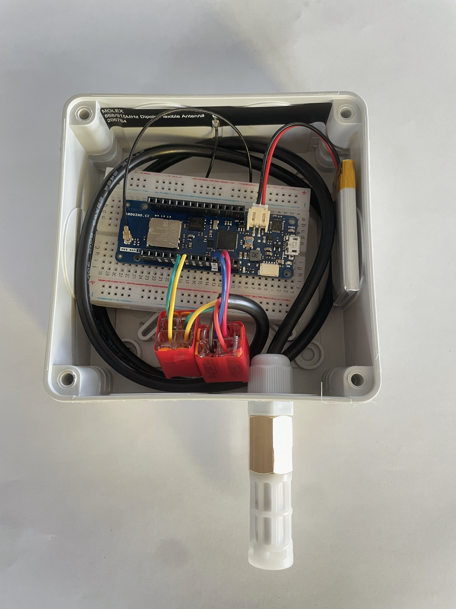
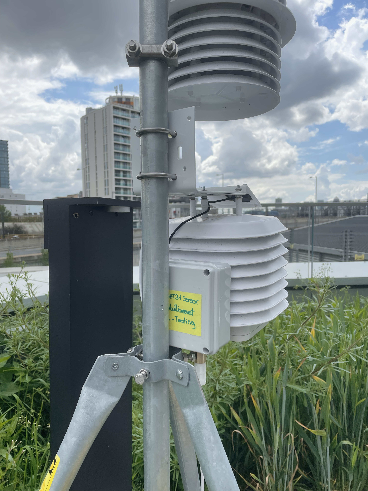

# Gardens of Things PhD Research - IoT Hardware 

This repository aims to document all the different Hardware elements deployed for "Gardens of Things" PhD Research. Work in progress. Any questions? Contact aude.vuilliomenet.18@ucl.ac.uk

Thank you to [@mitwelten/mitwelten-iot-hardware-poc](https://github.com/mitwelten/mitwelten-iot-hardware-poc) GitHub reposistory. A great resource that has inspired this repo.

## LoRaWAN Temperature&Humidity Sensor Node
LoRaWan SHT31 sensor node to monitor air temperature and humidity. Use MKR1310 Arduino Board to send data 1x every 5 minutes. 

 

### Software
- [MKRWAN1310_SHT31_TTN.ino](https://github.com/audevuilli/gardensofthings-iot-hardware/blob/main/LoRa_MKR1310_SHT31/MKR1310_SHT31_Arduino_Code/MKR1310_SHT31.ino) - (Arduino code to send data to The Things Stack)
- [Telegraf]

### Hardware
- [Arduino MKR WAN 1310](https://store.arduino.cc/products/arduino-mkr-wan-1310)
- [SHT31 Outdoor Temperature & Humidity Sensor](https://www.dfrobot.com/product-2160.html)
- [868/915MHz Dipole Antenna](https://www.mouser.co.uk/ProductDetail/Molex/206764-0200?qs=F5EMLAvA7IB89PXHoSyp7g%3D%3D)
- [3.7V 850mAh LiPo Battery](https://tinyurl.com/ywfr3y9s)

